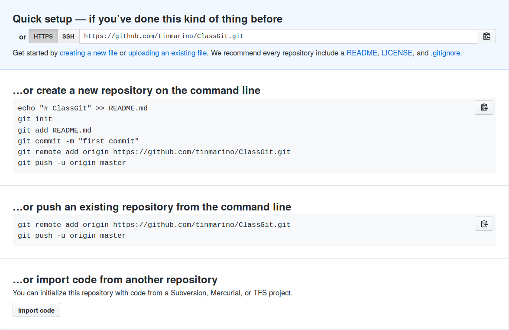

# Introduction

__Bonjour__ : bonjour les enfants, aujourd'hui nous allons apprendre `git`.

__Help__ : Comme dans tout interface en ligne de commande, la commande la plus importante est `help`. Quand je vous donne une sous-commande `git`, par exemple `init` qui s'utilise comme `git init .`, dans le doute, taper `git help init`. Un `PAGER` vous affichera l'aide. Pour en sortir, taper sur `q` (comme 'quit').


# Leçon 1 : Créer un dépôt Git

Il est fréquent de s'intégrer dans un projet déjà existant mais il est bon de savoir comment en commencer un. C'est pratique pour faire des tests.

Dans cette leçon nous verrons :

1. Le shell : `bash`
2. `git init` : pour commencer de rien
3. `git clone` : pour copier un projet

## 1. Le shell (ou terminal)

Malheureusement il faut commencer par le plus compliquer. En effet, `git` est un programme avec une interface de commande : CLI (Command Line Interface). En d'autres termes, il s'utilise dans un terminal.

1. Créer un répertoire pour le projet, par exemple `ClassGit`
2. Ouvrir un terminal dans ce repertoire
    - Linux :
        a) Aller dans le repertoire avec l'explorateur de fichier
        b) Cliquer le bouton de droite / Open in terminal
        c) Tapper `pwd` dans le terminal il doit vous répondre le chemin dans lequel vous êtes, qui se termine par ... `ClassGit`
        d) On est prêt, il faudra toujours faire les commandes `git` dans un terminal qui à son `working directory` à cette endroit. Sinon comment saurait - il de quel projet `git` il est question ?
    - Windows :
        a) Installer `git bash` depuis https://gitforwindows.org/
        b) Se référer à la procédure pour Linux : en effet, `git` à été crée par Linus pour Linux.
        c) Voir les [Différences Windows Vs Linux](#windows-vs-linux)

## 2. Git init

### Dépot local

Uns fois dans le bon repertoire entrer `git init .` (Le '.' signifie 'ici'). Le shell devrait vous répondre : 

```
Initialized empty Git repository in /home2/tinmarino/Desktop/ClassGit/.git/
```

Il vient de crée un réertoire caché `.git` dans lequel git cachera toute la misère (i.e. en langauge git les commits ou en anglais snapshots ou en français instantané)

Bravo ! Vous avez initialiser un dépot git sur votre machine. vous pouvez passer à la leçon 2. Mais pour pouvoir bénéficier de la synchronization via internet, il faut s'appuyer sur un serveur : `Github`.

### Dépot distant (github)

Vous avez tout deux déjà un compte Github :

1. Connectez-vous / dans vos dépots (ou repository) cliquer sur nouveau, ou simplement, cliquer sur le lien suivant : https://github.com/new
2. Crée le dépot en quelques clicks :
    - 
3. Expliciter à votre dépot local l'URL du dépot distant avec :
    - `git remote add origin https://github.com/tinmarino/ClassGit.git`
    - 

## 3. Git clone

Si un dépot existe déjà, crée par un copain par example tinmarino, vous pouvez le copier __Dans un nouveau répertoire vide__ avec 

```
git clone https://github.com/tinmarino/ClassGit.git .
```

Où :

1. __https//....__ :  est l'URL du project à crée (notez qu'il se termine par .git et non par .html)
2. __.__ : signifie `ici`.

Vous commener à saisir, on passe au choses sérieuses.

# Leçon 2 : Faire des changements

## Con .. texte

Git (regarder la référence en bas) :

1. Prend des shapshots (commits) de votre `working directory` (le chemin que retourne la command `pwd`) pour les mettre dans son dépot local (souvenez-vous le repertoire caché `.git`)
2. Pousse ces commits ver le dépots distant, sur github, afin que vos copains puissent les voir

Dans cette leçon nous verrons la partie 1, dans la suivante, et bein ... la 2 pardi !

## Pourquoi c'est con .. pliqué ?

Un commit se fait en 2 étapes et non une ! En théorie un petit `git commit -m 'Les message de mon commit'` suffierai, mais non ! Pourquoi ? Prétez attention au prochain paragraphe et au besoin, relisez le !

Je travail sur un projet et je modifi plusieurs fichier à plusieurs endroits. En solitaire, j'aurai envie de tout commiter. Et pourtant, il y a un fichier, disons `notes.md` où j'ai écrit mes petites notes, mes pensées persos, et je n'ai pas (encore) envie de les partager car ce n'est pas trés propre, clair. Pourtant les modification que j'ai fait sur le fichier `géolocalisation.c` sont prêtes pour 'partir en production' c'est à dire être envoyer au copains. De fait, je veux UNIQUEMENT commiter (rappel : snapchoter) le fichier `géolocalisation.c` et pas tout mon projet. Un commit se fait donc en 2 parties :  

## Athé .. Orie

1. Tout d'abord on déclare ce qu'on veux commiter dans la 'Staging Area' (un espace trés volatile). `git add géolocalisation.c`
2. On regarde si tout va bien : `git status`
3. Si tout va bien, ce qui est dans le stage (en vert) correspond à ce que je veux commiter ce tour si, je commit : `git commit -m 'Feature, new geolocalisation model'`. Notez que tout commit DOIT s'accompagner d'un message (ici dans l'argument déclaré par `-m` et entourer de guillemets)

## Pratique

On y va !

1. Crée un fichier appelé `Readme.md`
2. Écrire dans ce fichier le texte suivant (copier - coller pour les pros):

```

# Chapitre 1 : Abbé Pierre

* Il ne faut pas attendre d'être parfait pour commencer quelque chose de bien
* Nous avons autant besion de raisons de vivre que de quoi vivre
* C'est la vie qui doir créer la loi. Et non pas la loi, figer la vie
* Souviens-toi d'aimer

# Chapitre 2 : Informatique

* Le seul ordinateur réellement protégé est un ordinateur éteint ....et encore !!!  
* Rien n'est impossible à celui qui n'a pas à le faire
* Les discours ne font pas cuire le riz

```

3. Sauvegarder le fichier
4. `git status` : tu devrais voir `Readme.md` en rouge : 'Untracked'
5. `git add .` : pour ajouter ... tout ! On aurait pu faire `git add Readme.md`
6. `git status` : maintenant il est en vert : 'Staged'
7. `git commit -m 'First commit, some quotes'`
8. `git status`
9. `git log ` : regarder l'hisorique des commits : il devrait y en avoir qu'un. `gitk --all &` rapporte la même information via une interface graphique (c'est mieux)


Ca a marché ? Bravo ! Maintenant, tu créé n'iomporte quel fichier, écrit n'importe quoi puis avec :

1. `git add .` : Tout ajouter dans le stage
2. `git commit -m 'Customise ton message'`

Tu peux prendre une série de commit. `gitk` te permet de le visualiser et la sous command `checkout` te permet de remplacer ton 'Working Directory' à l'état dans lequel il était lors d'un précédent commit.


# Leçon 3 : Synchroniser avec les copains

L'exemple précédent n'était pas anondin : le nom de fichier :  `Readme.md` et son format : `markdown` sont connues de github. Se sera aficher joliement sur ta page github. Il reste juste à le pousser sur le dépot distant avec `git push`. Ca ne marche pas : il devrai te conseiller : `git push --set-upstream origin master`. Fais le ! Si il te dit : ` git remote add <name> <url>`, c'est que tu n'a pas bien fait l'initialisation du dépot et tu dois ajouter l'URL du dépot distant (remote repository) via (je répète en replaçant `<name>` par `origin` et `<url>` par ... ben l'url)

```
git remote add origin https://github.com/tinmarino/ClassGit.git
```

Ca marche ? Regarde github

Le contraire de `push` (toi -> github) est `pull` (github -> toi)


# Leçon 4 : Observer le status du dépot git

* `git log` : montre l'historique des commits
* `git status` : montre l'état du 'Working Directory' et de la 'Staging Area'
* `git diff` : montre les modificiation plus en profondeur.


# References


## Windows Vs Linux

1. Fins de lignes : elles sont `\r\n` pour Windows et seulement `\n` pour Linux. Quand git indique des changements sur toutes les lignes mais on ne les voit pas, c'est à cause de ça. Solution, demander à son éditeur de texte de sauvegarder le fichiers au format Linux ou au copain de les sauvegarder au format Windows ou à git d'ignorer les fins de lignes
2. Chemins : Les chemins sont séparer par des backslash sur Windows : `C:\Users\tinmarino\Desktop\ClassGit` et par des slash sous Linus : `/home/tinmarino/Desktop/ClassGit`. Git s'en fout mais mozilla firefox non. Il faut utiliser des slash en HTML, ça marche quand même sous Windows.
